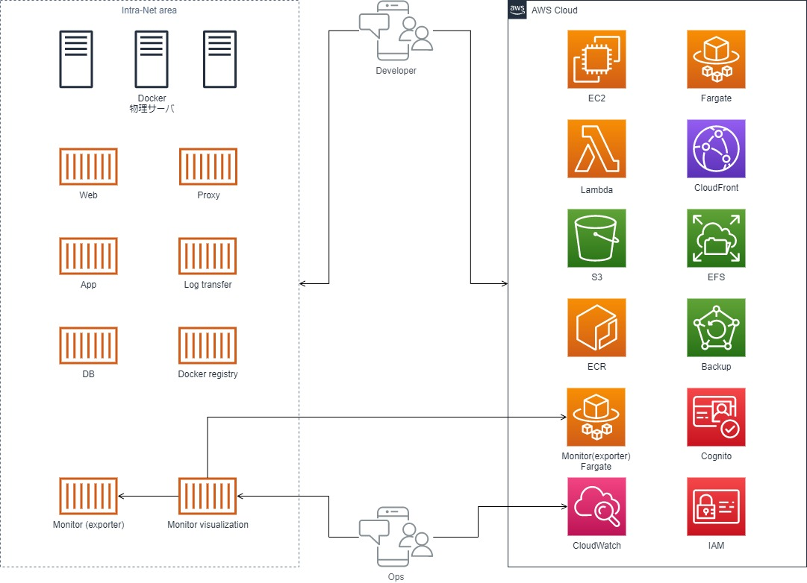
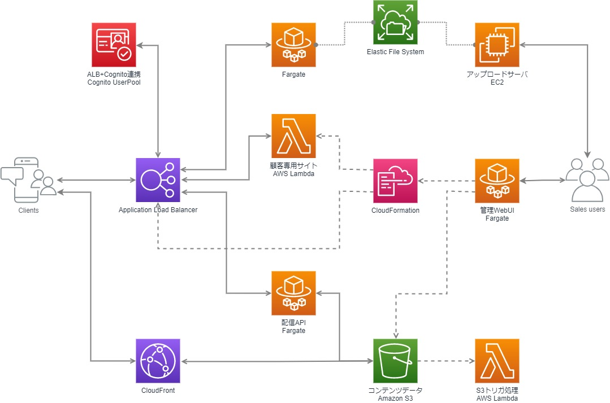

## About


**hibara428** と申します。

インフラ・バックエンドエンジニアです。
インフラの設計・構築・運用、バックエンド開発を主な仕事にしています。フロントエンド、ネイティブアプリ開発も多少経験があります。

| Q | A |
| --- | --- |
| 好きなAWSサービス | ECS、Lambda |
| 好きなプログラミング言語 | Golang ※勉強中 |
| 好きな運用管理ツール | 推しを探しています(少し前はTerraform推し) |
| 最近の関心 | 認証・認可、ゼロトラスト、サーバレス |

## Skills

### インフラ

| 技術項目 | 期間 | 備考 |
| --- | --- | --- |
| AWS | 5年以上 | 設計・構築・運用 |
| Azure | 1年程度 | 運用 | 
| 物理DC | 3年程度 | ラックマウントサーバ保守、配線等 |

### サーバ

| 技術項目 | 期間 | 備考 |
| --- | --- | --- |
| Linux(RedHat系) | 5年以上 | |
| Linux(Debian系) | 5年以上 | |
| Docker | 5年以上 | サーバ運用含む |
| Lambda | 2年程度 | 主にNode.js |

```
Apache、Nginx、PHP-FPM、Fluentd、Proftpd、Traefik、Harbor、GitHub Enterprise、etc...
```

### 運用

| 技術項目 | 期間 | 備考 |
| --- | --- | --- |
| Terraform | 3年程度 | |
| CloudFormation | 1年程度 | |
| Ansible | 1年程度 | |
| Prometheus | 3年程度 | |
| Grafana | 3年程度 | |

```
ITIL(v3)、ISMS
```

### バックエンド

| 技術項目 | 期間 | 備考 |
| --- | --- | --- |
| PHP | 5年以上 | |
| Node.js | 2年程度 | |
| TypeScript | 1年程度 | |
| Python | 2年程度 | |
| Perl | 2年程度 | |
| Golang | 3ヶ月程度 | |

```
OpenAPI、Postman
```

### フロントエンド、ネイティブアプリ他

| 技術項目 | 期間 | 備考 |
| --- | --- | --- |
| HTML5 | 3ヶ月程度 | |
| Android | 1年程度 | Kotlin、Java |
| iOS | 3ヶ月程度 | Swift、Objective-C |
| Google Apps Script | 3ヶ月程度 | |

## Business experiences & Hobbies

### バックエンド配信APIの設計・実装 (5年)

WebブラウザやスマートフォンアプリからのHTTPリクエストに対して、データを配信する認証認可付きRESTful APIを設計・実装。

#### 実装言語

- PHP5/7
- Lambda(Python)
- TypeScript

#### 備考

機能追加中心の作業だが、新規API設計・実装も経験。既存インタフェースに対して以下の改善に注力。

- キャッシュ可能性(CDN利用性)の向上
- 認証・認可の標準技術化による保守性と安全性の向上
- 設定の分離による機能拡張性の向上

### 開発・検証ハイブリッドクラウド基盤の構築・運用 (5年)

VMWareベースからDockerベースの開発・検証基盤に移行し、数年間運用。また外部公開を要する環境をAWSへ移行しハイブリッドクラウド構成。開発・検証の必要に応じて日々サーバを追加構築。

#### 規模感

- オンプレミス：ラックマウントサーバ3台、50コンテナ程度
- AWS：EC2 10台、ECS 20コンテナ、Lambda 30関数程度
- Prometheus+Grafana(+CloudWatch)での統合監視

#### 構成

構成を変更しつつ、既存開発フローに対応できるように考慮。要望に応じて、Web、App、DB、FTP、SSH、プロキシ等のサーバを追加構築。



また、非開発部門が容易かつ安全に特定顧客専用のサンプル公開環境を用意できるPHPアプリケーションを実装し、AWS上に環境構築。



#### 運用管理

開発・検証基盤のコード化に注力。基盤だけでなくアプリ実行環境の保守性を改善。運用管理はCloudFormation、Terraform、Ansibleを適宜選択。

### 新規クラウド基盤構築プロジェクト管理 (1年)

新規ハイブリッドクラウド基盤構築プロジェクトのプロジェクト管理補佐として、上流のプロジェクト管理に従事。要件定義、スケジュール管理、設計資料や構築物の検収など。

### ホスティングサービスのインフラ運用 (2年)

大手ユーザ企業システム部門にて、ホスティングサービスのインフラ運用に従事。

#### 規模感

- データセンタ上の100台以上の物理サーバ、およびVMWare基盤
- 10名前後のチーム

#### 運用作業例

- サーバ設計・構築(主にWeb、DB、FTP、踏み台サーバに従事)
- データセンタでの物理作業(ラックマウント、配線、工事対応等)
- 監視・障害対応
- ISMS対応
- 利用者向け管理Webサイト(Perl)の構築

### フロントエンド、ネイティブアプリ開発 (2年)

プロジェクト単位・タスク単位にて、フロントエンドやネイティブアプリの開発に従事。

- ブラウザアプリ開発(HTML5)
- Androidアプリ開発(Kotlin、Java)
- iOSアプリ開発(Swift、Objective-C)

### サークルでのゲーム制作 (3年)

大学時代はサークルにてWindowsプログラミングによるアクションゲーム等を制作。

## Certifications

| 取得年 | 資格名 |
| --- | --- |
| 2011/10 | 応用情報技術者 |
| 2013/10 | ITIL V3 Foundation |
| 2014/07 | LPIC レベル1 |
| 2015 | 情報セキュリティ管理士認定試験 |
| 2016 | EXIN OpenStack Foundation |
| 2019/02 | AWS Certified Solutions Architect - Associate (SAA) |
| 2021/02 | AWS Certified SysOps Administrator - Associate (SOA) |

## GIZMO trends

ギズモの知名度向上のため、今週の日本の`ギズモ`、`グレムリン`、`モグワイ`のトレンドを表示しています。

参照：[グレムリン \(映画\) \- Wikipedia](https://ja.wikipedia.org/wiki/%E3%82%B0%E3%83%AC%E3%83%A0%E3%83%AA%E3%83%B3_(%E6%98%A0%E7%94%BB))

<script type="text/javascript" src="https://ssl.gstatic.com/trends_nrtr/2674_RC03/embed_loader.js"></script> <script type="text/javascript"> trends.embed.renderExploreWidget("TIMESERIES", {"comparisonItem":[{"keyword":"ギズモ","geo":"JP","time":"now 7-d"},{"keyword":"グレムリン","geo":"JP","time":"now 7-d"},{"keyword":"モグワイ","geo":"JP","time":"now 7-d"}],"category":0,"property":""}, {"exploreQuery":"date=now%207-d&geo=JP&q=%E3%82%AE%E3%82%BA%E3%83%A2,%E3%82%B0%E3%83%AC%E3%83%A0%E3%83%AA%E3%83%B3,%E3%83%A2%E3%82%B0%E3%83%AF%E3%82%A4","guestPath":"https://trends.google.co.jp:443/trends/embed/"}); </script>
